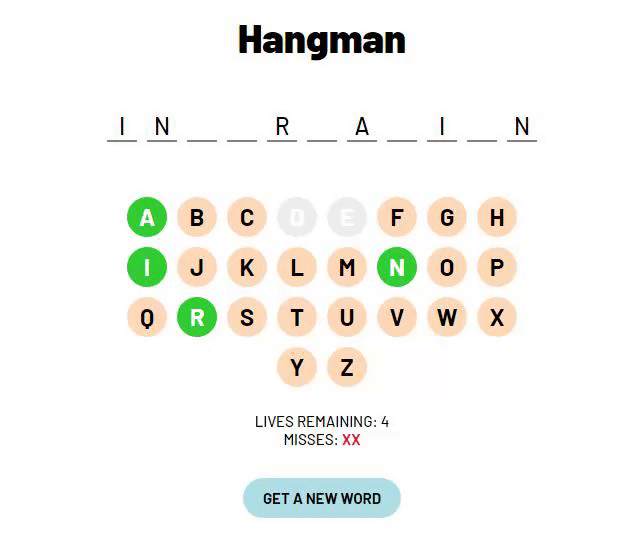

# Hangman
A basic implementation of Hangman in JavaScript as described by the Landmark Solutions tech test.
You can play here: https://andfcam.github.io/hangman/



## General info
A word is selected at random from a list of Landmark-themed words (see below) and displayed as a number of blanks. It is the role of the player to guess the word by suggesting letters. You are allowed five incorrect guesses before the game ends. You can restart the game at any time by requesting a new word using the blue button. The number of incorrect guesses (marked as Xs) and lives remaining are displayed beneath the letters.

The game accepts user input from the keyboard as well as the letters on-screen. Correct guesses will turn the corresponding letter green, incorrect guesses will turn the letter grey. You cannot guess the same letter twice. Cases are insensitive.

List of example words:
```
angular
data
exeter
hireme
information
landmark
ordnance
property
reports
solutions
survey
technology
```

## Technologies
The project is created with:
* HTML5
* Sass (CSS), and
* JavaScript

